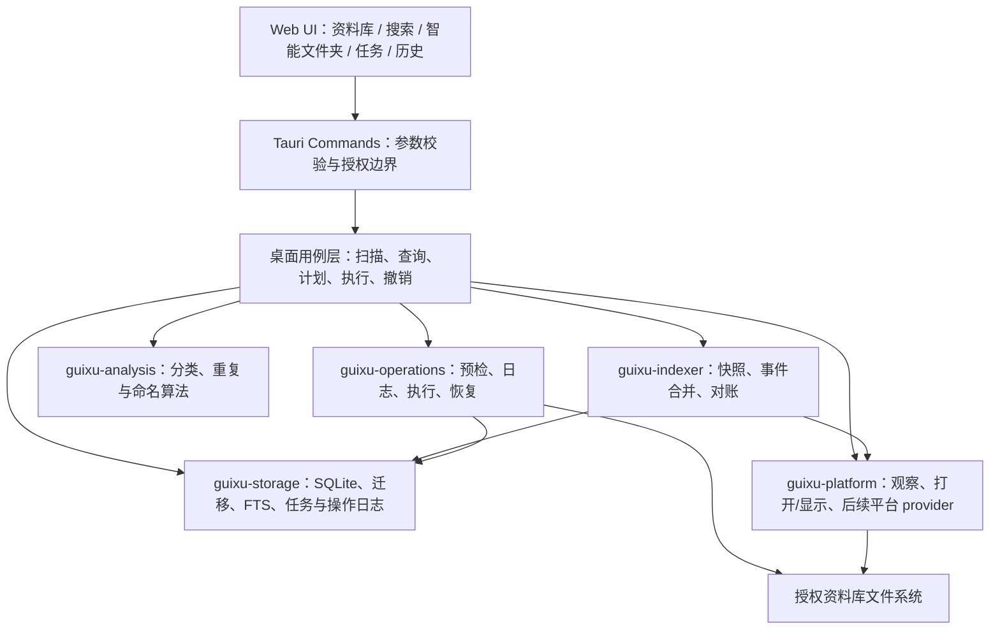
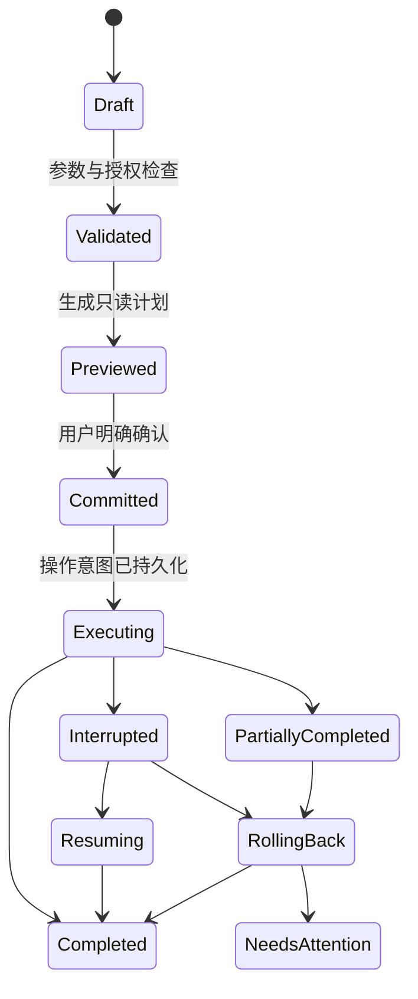

# 归序整体方案与实施基线

> 文档状态：主方案 / 当前事实来源
>
> 最近检查：2026-07-28（Asia/Shanghai）
>
> 适用范围：Rust + Tauri 2 桌面主线；旧 Python、Swift、C# 项目仅作行为与迁移审计基线

## 1. 文档目的

本文统一产品范围、交互、架构、数据、安全、算法、里程碑与验收标准。功能是否“完成”以代码、自动化测试和实际交互验证共同为准，而不是以旧 README、原型入口或算法函数存在为准。

配套文档：

- [2026 算法与技术架构](./ALGORITHM_DESIGN_2026.md)
- [旧项目合并边界](./LEGACY_MERGE_BOUNDARY.md)
- [旧项目审计入口](./legacy-audit/README.md)
- [逐模块迁移矩阵](./legacy-audit/FEATURE_MATRIX.md)
- [风险登记表](./legacy-audit/RISK_REGISTER.md)

## 2. 产品定位与原则

归序是一款离线优先、本地运行、可解释且可恢复的文件管理工具。它帮助用户建立资料库、快速查找文件、生成整理计划，并在明确确认后安全执行文件操作。

核心原则：

1. **本地优先**：默认不上传文件内容；任何外部模型能力都必须可选并明确告知数据边界。
2. **选择优先**：主流程通过系统文件夹选择器授权目录，不要求用户手工输入路径或命令。
3. **先预览再写入**：整理、移动、重命名、复制和清理必须先形成计划，执行前再次预检。
4. **不覆盖、可追踪、可恢复**：默认禁止覆盖；每个写操作持久记录；中断后可审计，完成后可撤销。
5. **算法只提供建议**：分类、保留项和相似度结果必须带证据，不能绕过用户确认直接删除文件。
6. **能力渐进增强**：基础扫描、搜索和安全操作不依赖 AI、Spotlight、Vision 或第三方服务。

当前非目标：云盘同步、多人协作、系统级 Finder/Explorer 扩展、默认自动删除、无确认的后台整理，以及在核心稳定前引入向量数据库。

## 3. 当前完成度

| 里程碑 | 状态 | 当前结果 | 验证门 |
| --- | --- | --- | --- |
| M0 基线与页面修复 | 已完成 | 响应式布局、焦点/滚动修复、OOXML 容器分类 | 900/960/1180/1440 宽度检查；单元测试 |
| M1 后台任务闭环 | 已完成 | 独立扫描连接、进度、暂停/恢复/取消、事件推送、多资料库监听 | Rust workspace 测试；任务状态迁移测试 |
| M2 文件浏览交互 | 已完成 | 排序、列表/网格、键盘导航、批量栏、预览、打开、访达中显示 | 浏览器演示、真实 `.app` 窗口与原生目录选择器；命令规格与授权边界测试 |
| M3 搜索与智能文件夹 | 已完成 | Unicode/Trigram 搜索、结构化条件、版本化智能文件夹规则 | 查询解析、迁移、短词与子串搜索测试 |
| M4 通用文件操作 | 已完成 | 批量重命名、安全复制、通用移动与受控隔离区删除 | 故障注入、跨卷、冲突、撤销、重启恢复 |
| M5 算法生产化 | 进行中 | M5.1–M5.3 完成；M5.4 文本/图片基础 provider、EXIF 方向归一化、持久任务与 Web/App 统一候选 UI 完成，阈值基准和增强 provider 待实现 | 基准集、准确率、性能、内存和取消测试 |
| M6 平台增强与发布 | 待实现 | Quick Look、Spotlight/PDF/Vision、Windows provider、安装发布 | 真机矩阵、签名/权限、升级/降级和安装包验收 |

截至本文检查时，Rust workspace 共 **81 项测试通过、0 项失败**。这证明现有核心路径满足当前测试约束，不等同于 M5–M6 已完成。

## 4. 总体架构



### 4.1 模块职责

| 模块 | 职责 | 禁止事项 |
| --- | --- | --- |
| `apps/desktop/web` | 页面、状态、交互和可访问性 | 直接访问任意本地路径；自行执行文件写入 |
| `apps/desktop/src-tauri` | 命令适配、资料库授权、后台任务编排 | 堆积不可复用算法；绕过操作层改文件 |
| `guixu-domain` | 稳定 ID、领域状态和接口数据 | 平台 UI 或数据库细节 |
| `guixu-storage` | Schema 迁移、索引、FTS、任务、计划和日志 | 隐式文件系统副作用 |
| `guixu-indexer` | 全量扫描、变化合并、快照对账 | 根据事件直接移动或删除文件 |
| `guixu-analysis` | 只读分类、重复和命名建议 | 决定最终写操作 |
| `guixu-operations` | 预检、事务步骤、执行、撤销和恢复审计 | 默认覆盖或不可恢复删除 |
| `guixu-platform` | 平台安全调用和只读能力适配 | 包含业务规则或绕过授权根目录 |

## 5. 核心运行流程

### 5.1 资料库建立与索引

1. 用户点击“选择文件夹”，系统选择器返回目录。
2. 桌面端规范化路径、确认其为目录，登记资料库根。
3. 后台扫描任务使用独立数据库连接，递归枚举普通文件，不跟随符号链接。
4. 扫描按批写入快照并发送真实进度；用户可暂停、恢复或取消。
5. 扫描结束后对账：新增/变化文件更新，缺失文件标记，而不是依赖单次事件推断最终状态。
6. 目录监听只产生“需要重新对账”的信号；消抖和权威快照负责恢复一致性。

### 5.2 浏览、搜索与智能文件夹

- 文件列表使用稳定游标分页，避免大资料库一次性载入。
- 普通词走 FTS5；短词与 Unicode 名称可检索；Trigram 索引用于子串匹配。
- 结构化查询当前支持 `ext:pdf`、`size:>10MB` 等条件，并可与文本组合。
- 只有筛选条件、没有自由文本的查询同样有效。
- 智能文件夹保存版本化规则 JSON 与可显示查询，后续 schema 演进时必须迁移或兼容读取。

### 5.3 整理计划与执行



执行不变量：

- 计划必须绑定文件 ID、源路径、快照和目标；当前整理计划有效期为 15 分钟。
- 执行前重新验证身份、大小、修改时间、授权根与目标冲突。
- 操作头和逐项意图先进入 SQLite，再发生磁盘写入。
- 同卷优先排他原子移动；跨卷采用复制、落盘、BLAKE3 校验、排他发布，再移除源文件。
- 默认禁止覆盖；冲突应返回“跳过/重命名/需要处理”，不能静默替换。
- 启动恢复只做身份审计；歧义状态不得自动继续移动或删除。

### 5.4 打开、显示与预览

- UI 只能用 `library_id + file_id` 请求能力，不能传任意绝对路径。
- 后端从索引解析路径，再确认普通文件、非符号链接、规范化后仍位于授权根内。
- 打开和“在访达中显示”使用参数化平台调用，不拼接 shell 命令。
- 文本预览有大小上限和截断标记；二进制或不支持格式只展示元数据。

## 6. 算法方案

### 6.1 文件身份与变化判定

采用分层身份，而不是把路径当作唯一身份：

1. 平台稳定标识（可用时）用于同卷重命名重关联。
2. 规范化路径用于授权和展示。
3. 大小、修改时间、文件类型等快照用于快速变化判定。
4. 快速指纹和强哈希只在候选集合上计算，用于内容确认。

任何缓存键都必须带入能防止陈旧命中的快照信息；遇到权限、锁定或读取中变化，结果应标记为跳过/不确定，而不是判为相同。

### 6.2 类型分类

判定优先级为容器/魔数、可靠元数据、扩展名、未知类型。ZIP 容器必须继续识别 OOXML 等复合格式，不能把 `.docx/.xlsx/.pptx` 归为普通压缩包。分类结果包含类别、依据和置信信息；算法不能直接生成写操作。

### 6.3 精确重复

当前实现已具备只读分层检测：

`大小分桶 → 快速指纹 → 流式强哈希 → 稳定分组`

M5 需要补齐：

- 基于稳定身份和快照的持久哈希缓存；**M5.1 已完成：schema 9 缓存算法版本、快照键、快速/完整哈希，内容快照变化失效而路径移动保持命中。**
- 稀疏文件、读取中变化、权限失败和超大文件策略；
- 可解释保留评分：路径层级、副本名称、隐藏目录、修改时间与稳定路径顺序；**M5.2 已完成基础评分、理由展示、逐项选择、整组保留保护，并接入可恢复清理计划。用户固定项和真实数据校准待后续扩展。**
- 只输出建议和可回收空间，清理必须接入 M4 的废纸篓/隔离与撤销链路。

### 6.4 相似内容

相似图片建议采用 EXIF 方向归一化、尺寸归一化、dHash/pHash 特征、分桶/近邻候选和二次校验。相似文本建议采用格式提取、Unicode 归一化、分词/字符 n-gram、SimHash/MinHash 候选和可解释片段比对。

相似结果必须是“候选”，并显示阈值、特征类型和差异证据。阈值需在真实基准集上按精确率/召回率选择，不以少量手工样本宣布完成。

### 6.5 安全命名与冲突

- 先做 Unicode 规范化、平台保留名和非法字符校验。
- 保留扩展名，限制组件长度和完整路径长度。
- 默认冲突策略为不覆盖并生成稳定编号；批次内和磁盘现状需一起预检。
- 大小写不敏感文件系统、归一化等价名称和并发创建必须纳入冲突测试。

## 7. UI 与交互框架

主导航按“资料库、智能文件夹、大文件、重复文件、可恢复文件、操作历史”组织；设置固定在侧栏底部，与资料库业务导航分离。设置内部按通用、外观与显示、扫描与性能、本地数据分区。统一交互约束如下：

颜色、表面层级、圆角、按钮、卡片、弹窗和状态语义的唯一规范见 [UI 设计系统](./UI_DESIGN_SYSTEM.md)。新增模块必须复用设计令牌和公共组件，不得通过近似色或独立控件样式形成新的视觉分支。

- 首次进入和切换资料库都以系统文件夹选择器为主入口。
- 文件区支持列表/网格、排序、单选、多选、全选、键盘移动焦点、Enter 打开和双击打开。
- 选中项后出现批量操作栏；任何写操作都进入预览确认，而不是立即执行。
- 右侧预览展示名称、路径、大小、类型、文本片段及打开/显示操作。
- 任务页展示真实状态与进度，并提供符合状态机的暂停、恢复、取消按钮。
- 错误必须贴近触发位置，说明失败对象、原因和可执行的下一步；批处理返回逐项结果。
- 900×620 为桌面最小验收窗口；窄窗口侧栏可滚动，主要操作不被遮挡；键盘焦点清晰可见。

M4 应把重命名、复制、移动和移入废纸篓统一为同一套“选择 → 参数 → 预览 → 确认 → 进度 → 结果/撤销”交互，不为每种操作复制独立状态机。

## 8. 数据、隐私与安全

### 8.1 数据存放

Tauri 主线数据库名为 `guixu.sqlite3`，默认位于系统分配的应用数据目录；开发或测试可通过 `GUIXU_DATA_DIR` 指定目录。当前 schema 版本为 **11**，迁移只允许前向、顺序执行，并拒绝打开高于当前程序支持版本的数据库。v7 增加发布校验信息，v8 增加本地应用设置，v9 增加绑定文件快照与算法版本的哈希缓存，v10 增加持久后台任务结果，v11 增加文件特征、相似运行与候选边。

数据库包含资料库根、文件索引、搜索索引、任务、智能文件夹、计划、操作和逐项日志。文件正文不进入数据库，有限预览只在本机按需读取。

### 8.2 安全边界

- 只有用户通过系统选择器授权的资料库根可以被索引和操作。
- 不跟随符号链接；打开、显示、预览和写操作都重新验证规范路径边界。
- 任务和操作使用独立连接/事务，UI 线程不承担大规模 I/O。
- 当前没有数据库加密，不在设置中作虚假承诺；引入前需先定义威胁模型和密钥管理。
- 外部 AI provider 尚不是核心依赖；未来接入必须默认关闭、支持取消/超时并明确发送内容。

## 9. 后续实施顺序

### M4：通用文件操作闭环（最高优先级）

1. 扩展领域模型：`Rename/Move/Copy/Trash` 意图、冲突策略和逐项结果。**M4.1–M4.5 已完成：类型/schema、批量重命名、安全复制、通用移动和可恢复删除均已闭环。**
2. 复用预检、日志和执行状态机，避免在 Tauri 命令中实现业务逻辑。
3. 完成重命名、同卷移动、跨卷复制/移动、系统废纸篓或可恢复隔离区。
4. 增加批量操作参数页、计划差异预览、进度、部分失败和撤销入口。
5. 每完成一种操作，先通过单元测试、临时目录集成测试和浏览器交互验证，再进入下一种。

M4 验收必须覆盖：同名冲突、源文件消失、执行中被修改、权限拒绝、跨卷、应用中断、撤销目标被占用、符号链接和授权逃逸。

### M5：算法生产化

1. 建立匿名化基准集、期望结果和性能预算。
2. 先实现哈希缓存与重复保留评分，再接入清理计划。**持久哈希缓存、基础保留评分和可恢复清理接线均已完成。**
3. 实现图片相似候选，完成阈值评估后开放 UI。
4. 实现文本提取与相似候选；不支持格式显式降级。
5. 分类和智能命名统一输出“建议、依据、置信度”，并可被用户覆盖。

### M6：平台增强与发布

1. macOS Quick Look、Spotlight、PDFKit/Vision provider；每项均可禁用和降级。
2. Windows 文件夹授权、打开/显示、目录事件及元数据 provider。
3. 建立 macOS/Windows 真机矩阵，完成签名、公证/安装、权限、升级和数据库迁移测试。
4. 补齐性能遥测（仅本地）、诊断导出、版本兼容和发布说明。

## 10. 验证策略

| 层级 | 目标 | 必测内容 |
| --- | --- | --- |
| 单元测试 | 纯算法和状态机 | 查询解析、分类、命名、身份、状态迁移、冲突 |
| 存储迁移测试 | 数据兼容 | 空库升级、逐版本升级、未来版本拒绝、FTS 一致性 |
| 临时目录集成测试 | 真实文件语义 | 移动/复制/撤销、跨卷模拟、权限、链接、部分失败 |
| Tauri 命令测试 | 授权和适配 | 任意路径拒绝、索引解析、打开/显示参数化调用 |
| 浏览器交互测试 | 快速页面行为 | 选择、多选、快捷键、批量栏、预览、任务和错误态；不作为最终 UI 验收 |
| 真机 E2E | 系统能力 | 原生选择器、真实打开/显示、监听、休眠恢复、安装包 |
| 性能基准 | 可扩展性 | 10k/100k/1M 文件扫描、搜索延迟、内存、取消响应 |

当前已执行的基线命令：

```bash
cargo test --workspace
cargo fmt --all --check
cargo clippy --workspace --all-targets --all-features -- -D warnings
node --check apps/desktop/web/app.js
git diff --check
```

说明：Tauri 官方 debug `.app` 已完成真实窗口、核心 capability、相似任务、设置页、900×620 响应式和 macOS 原生目录选择器验收；真实“打开/在访达显示”、正式签名、公证与安装包仍需发布阶段真机验收。

## 11. 风险与决策

| 优先级 | 风险 | 当前控制 | 后续动作 |
| --- | --- | --- | --- |
| P0 | 文件写入造成丢失或覆盖 | 计划、预检、持久日志、默认不覆盖 | M4 故障注入和跨卷恢复测试 |
| P0 | 数据库状态与磁盘分叉 | 逐项意图、恢复审计、快照对账 | 明确所有部分失败补偿规则 |
| P1 | 监听事件丢失/风暴 | 消抖合并、权威重扫 | 大目录与休眠恢复压力测试 |
| P1 | 相似算法误判导致误清理 | 当前不开放删除；算法只给候选 | 基准集阈值与人工确认 |
| P1 | 文档夸大完成度 | 本文区分完成/待实现/待真机验证 | 每个里程碑结束同步文档 |
| P2 | 大资料库性能不足 | 游标分页、FTS、分层哈希 | 建立 10k/100k/1M 基准 |
| P2 | 平台差异扩大核心复杂度 | 平台能力收口到 provider | 契约测试与失败降级 |

## 12. 完成定义与文档治理

单项功能只有同时满足以下条件才可标记“完成”：

1. 用户主路径、空状态、错误状态和取消路径可用。
2. 核心逻辑位于正确模块，未绕过授权与操作状态机。
3. 自动化测试覆盖正常、边界和故障路径。
4. 相关窗口尺寸或平台完成实际交互验证。
5. 文档、限制和未验证项与代码一致。

文档职责：

- 本文是总体范围、状态和实施顺序的唯一事实来源。
- 根 `README.md` 只提供当前产品概览、启动和验证入口。
- `docs/legacy-audit/` 保存旧项目证据和迁移裁决，不代表当前实现状态。
- 每完成一个里程碑，先更新状态、测试数量和已知限制，再开始下一阶段。

## 13. 下一次实施检查点

M5.3 已完成。M5.4 已完成文本 SimHash、受限图片解码、EXIF 方向归一化与 dHash、快照缓存、LSH 候选、持久任务和 Web/App 同步只读界面；下一步建立真实阈值基准，并补充 pHash/MinHash 与 Vision 增强 provider。完成准确率评估前不开放批量清理。
