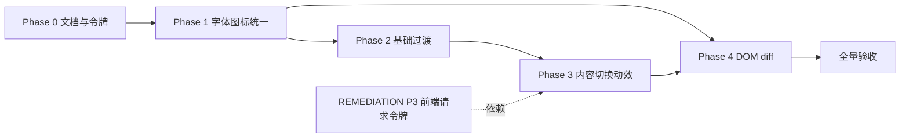

# 归序 UI 抛光方案

> 状态：实施跟踪稿 v3（2026-07-29）
>
> 适用范围：桌面主线 Web UI（`apps/desktop/web/`）
>
> 关联文档：[UI 设计系统](./UI_DESIGN_SYSTEM.md)、[MASTER_PLAN](./MASTER_PLAN.md)、[REMEDIATION_PLAN](./REMEDIATION_PLAN.md)
>
> 目标：解决字体/控件不统一、视觉令牌未落地、界面切换生硬缺少动效等问题，在不改变业务逻辑的前提下，按主流桌面应用标准（Apple HIG / Material 3 / Fluent 的交互通则）提升整体质感与一致性。
>
> v2 修订说明：对照 `app.css` / `app.js` / `index.html` 全量验证 v1 诊断数据（修正记录见第 12 节）；合并 2026-07-29 UI 专项检查的新增发现（中文字距、字体栈平台回退、task-action 规格等）；补齐主流交互模式规范（对比度门禁、间距标尺、弹窗 Esc 动画、骨架屏、确定性进度、Toast 生命周期等）。

> v3 实施状态：Phase 0–3 已落地；Phase 4 已完成文件选中态局部 patch 与长列表 `content-visibility` 基础优化。弹窗进出场、通知生命周期、批量栏、任务进度、骨架屏、预览淡入、SVG 图标、双重 reduced-motion、设置分区动画及 900×620 响应式均已在真实 Tauri 窗口验证。下文“现状诊断”保留为改造前基线，不能再视为当前缺陷清单。

---

## 1. 背景与问题摘要

设计系统 v1（`UI_DESIGN_SYSTEM.md`）已在颜色语义、组件分类、页面结构上建立规范，但当前实现存在四类系统性缺口：

1. **排版体系缺失** — 仅有颜色令牌，字号/字重/行高/间距无统一来源，15 档字号并存，最小 8px，中文标题带负字距。
2. **令牌落地不完整** — `app.css` 中 60 个去重硬编码 hex（71 处）与非标准圆角并存，侧栏次级色未收拢；部分次级文字对比度不达 WCAG AA。
3. **动效体系空白** — 全量 DOM 替换 + 0 处 transition + 仅 1 个 keyframes，交互瞬间跳变。
4. **交互模式缺失** — 无骨架屏、无确定性进度、通知无生命周期、弹窗无进出场，与主流桌面应用体验差距明显。

本方案按「先统一静态视觉 → 再补基础过渡 → 再优化内容切换 → 最后优化渲染」的顺序推进，每阶段均可独立验收。

---

## 2. 现状诊断（v2 已逐条对照代码验证）

### 2.1 字体与排版

| 问题 | 具体表现（已验证） | 影响 |
| --- | --- | --- |
| 无字体令牌 | 设计系统只定义 `--color-*`，未定义 `--text-*` / `--font-*` / `--space-*` | 新增样式各自为政 |
| 字号过碎 | CSS 中 `font-size` 共 **15 档**：8/9/10/11/12/13/14/15/16/18/19/20/21/25/28px；其中 **8–10px 合计 19 处** | 视觉节奏混乱 |
| 极小字号滥用 | 8px（智能文件夹副标题、重复文件详情）、9px（批量栏提示、历史详情、状态 pill、**任务按钮**）、10px（危险按钮、文件徽章、弹窗错误） | 中文低于可读与无障碍下限 |
| 按钮字号分裂 | `.primary-button` 13px；`.quiet-button` 12px；`.danger-button` 10px；`.task-action` **9px**；`.load-more` 11px；`.batch-primary` 10px | 同类控件不像同一产品 |
| 按钮高度分裂 | 主 38px / 次·搜索 32px / 危险 30px / 任务 28px / 加载更多 34px | 工具栏视觉跳跃 |
| 非标准字重 | `font-weight: 560`（`.smart-folder strong`）、`750`（`.preview-type`） | 非可变字体下回退不可预期 |
| **中文标题负字距** | `h1 { letter-spacing: -.025em }`（`app.css:90`）——西文标题手法误用于中文 | “我的资料库”字面互相挤压，是“字体显示不对”的直接原因之一 |
| **字体栈缺平台回退** | `:root` 字体栈无 `Microsoft YaHei` / `Noto Sans CJK SC`（`app.css:3`） | Windows/Linux 中文由系统随机链接字体渲染，粗细与灰度不可控 |
| 字体族混用 | 正文系统 sans；`.eyebrow` 等宽（英文标签，可保留）；`.notice-icon` Georgia 衬线 | 通知区与整体风格脱节 |
| 图标体系分裂 | 侧栏已统一 SVG `.ui-icon`；工具栏仍用字符 `▦`/`☷`（`app.js:1719`）、`↑`/`↓`（`app.js:1712`）、`＋`、`⌁`、`…`（`app.js:408`）、`×` | 字符依赖平台字体回退，基线/粗细/大小跨平台不一致 |

**典型冲突示例（`app.css`）：**

- `.smart-folder small { font-size: 8px; }` vs `.sidebar-foot small { font-size: 11px; }`
- `.primary-button { font-size: 13px; }` vs `.danger-button { font-size: 10px; }` vs `.task-action { font-size: 9px; }`
- 三种卡片列表标题三个字号：`.plan-paths strong` 11px / `.history-item-head strong` 12px / `.file-copy strong` 13px

### 2.2 颜色、对比度与圆角

- **硬编码 hex：60 个去重值、71 处**（`:root` 之外），与「禁止近似色、优先复用语义变量」原则冲突。侧栏即有 6 种近似灰绿（`#899990`/`#b2bdb6`/`#73837a`/`#829087`/`#aebbb3`/`#8fa097`）。
- **对比度不达标（WCAG AA 实测，v2 新增）**：

| 颜色对 | 实测对比度 | AA 要求（正文 4.5:1） | 处置 |
| --- | --- | --- | --- |
| `--color-text-muted #89938c` on 白/面板 | ≈3.2:1 | ❌ 不达标 | 调整为 `#6d7770`（≈4.7:1） |
| 硬编码 `#7e8982`（表头/设置说明，3 处） | ≈3.6:1 | ❌ 不达标 | 归并到调整后的 muted 令牌 |
| 侧栏 `#73837a` on `#17231d`（8px 副标题） | ≈4.1:1 | ❌ 边缘 | 提字号至 11px 并调亮为 `#84968c`（≈5.2:1） |
| 其余文字/状态色对 | 4.5–11:1 | ✅ | 不变 |

- **圆角**：令牌 `--radius-control/card/panel/modal`（7/10/14/16）已定义，但仍有 5/6/8/9/13px 硬编码（999px 胶囊属合法语义，保留并命名 `--radius-pill`）。
- 阴影仅有 3 档令牌，无滥发现象。

### 2.3 组件结构（已验证）

- **空状态不一致**：主文件列表有 icon + 标题 + 描述；历史/重复/相似弹窗的空态和加载态仅 `textContent`。
- **弹窗信息密度分裂**：重复文件区 8px 文字 vs 设置页 11–13px。
- **DOM 更新方式**：`app.js` 共 **16 处 `replaceChildren()`** 全量替换（文件列表、预览、任务、历史、重复、相似等）；选中文件也会重建整表。
- **表头/批量栏**：`.table-head` 非粘性（在长列表中滚动后不可见，主流文件管理器为粘性表头）——列入 Phase 1 评估项，非强制。

### 2.4 动态效果（已验证）

| 类型 | 现状 |
| --- | --- |
| CSS `transition` | **0 处**（除 `reduce-motion` 禁用规则外） |
| CSS `@keyframes` | **仅 1 个** `pulse`（busy 通知图标） |
| 弹窗 ×7 | 原生 `<dialog>` 直接 `showModal()` / `close()`，无进出场；Esc 关闭无动画钩子 |
| 列表/预览 | 瞬间替换，无淡入、无骨架屏 |
| 批量操作栏 | `[hidden]` 瞬间显隐 |
| 视图切换 | 列表 ↔ 网格瞬间切换 |
| 任务中心 | 圆点静态；后端 `Job.progress_current/progress_total` 已存在但**无进度条** |
| 通知 | 常驻无生命周期；成功类消息不自动消退 |
| 无障碍动效 | 「减少动态效果」设置已接入 `body.reduce-motion`，但几乎无内容可关；未监听 `prefers-reduced-motion` |

**结论：** `reduceMotion` 基础设施（设置项 + body 类）已就绪，动效体系本身尚未建立。

---

## 3. 设计参照与原则（主流标准落点）

不照搬任一体系视觉，只采用其经过验证的交互通则：

| 参照 | 采用的通则 |
| --- | --- |
| Apple HIG（macOS 主场） | 动效应“短而含蓄”：微交互 100–150ms、面板 200–250ms；语义动效（解释状态变化）优先于装饰动效 |
| Material 3 | 时长窗口 50–500ms；进入用 decelerate、离开用 accelerate；强调曲线仅用于主操作反馈；stagger 单项 ≤50ms |
| Fluent | 焦点环、禁用态、hover 反馈三态齐全是“完成度”底线 |
| WCAG 2.2 AA | 正文对比度 ≥4.5:1；非文本控件对比 ≥3:1；`prefers-reduced-motion` 必须生效 |
| 性能通则 | 只动画 `transform`/`opacity`/`filter`；不为布局属性做逐帧动画；长列表渲染用 `content-visibility` |

---

## 4. 改进目标（验收标准）

完成本方案后，应满足：

1. **同一语义层级，全应用同一字号/字重**（caption ≥ 11px；正文 13–14px；标题阶梯 16/19/28px）；中文标题无负字距；字体栈含 Windows/Linux 中文回退。
2. **文字对比度 100% ≥ WCAG AA 4.5:1**（装饰性元素除外）；新增样式 100% 走设计令牌；硬编码 hex 清零（阴影 alpha 与令牌定义除外）。
3. **所有交互态有 120–200ms 过渡**，且受「减少动态效果」与 `prefers-reduced-motion` 双重控制。
4. **主要状态变化有符合第 6 节规范的过渡**（弹窗、通知、批量栏、预览、任务、视图切换），900×620 最小窗口可用性不受影响。
5. **同类控件同形**：主/次/危险按钮、空状态、图标在同一视图内尺寸一致。

---

## 5. 设计令牌扩展（写入 `UI_DESIGN_SYSTEM.md` 与 `app.css :root`）

### 5.1 排版

```css
--font-sans: -apple-system, BlinkMacSystemFont, "SF Pro Text", "PingFang SC",
             "Helvetica Neue", "Segoe UI", "Microsoft YaHei",
             "Noto Sans CJK SC", sans-serif;   /* v2 补 Windows/Linux 中文回退 */
--font-mono: ui-monospace, "SFMono-Regular", Menlo, Consolas, monospace;

--text-caption: 11px;    /* 标签、表头、次要说明；全应用下限，禁止更小 */
--text-body-sm: 12px;    /* 次按钮、元数据 */
--text-body: 13px;       /* 主内容、标准按钮 */
--text-body-lg: 14px;    /* 侧栏导航 */
--text-title-sm: 16px;   /* 面板标题、设置分组标题 */
--text-title: 19px;      /* 弹窗标题 */
--text-display: 28px;    /* 页面主标题 h1 */

--weight-regular: 400;
--weight-medium: 500;
--weight-semibold: 600;
--weight-bold: 700;

--leading-tight: 1.25;
--leading-normal: 1.45;
--leading-relaxed: 1.6;
```

**硬性规则：**

- 禁止 8–10px 正文字号（等宽代码预览 11px）。
- 禁止非标准字重（560、750 等）；仅 400/500/600/700。
- **中文标题 `letter-spacing: 0`**；负字距只允许出现在纯西文场景（当前无）。
- `.eyebrow` 保留 `--font-mono` + `.12em`（纯英文标签）；`.notice-icon` 改 SVG，弃用 Georgia。

### 5.2 间距（v2 新增，4px 基栅）

```css
--space-1: 4px;  --space-2: 8px;  --space-3: 12px; --space-4: 16px;
--space-5: 20px; --space-6: 24px; --space-8: 32px;
```

现有 9/13/17/22px 等散值 padding/margin 在 Phase 1 就近归并（9→8、13→12、17→16、22→24 等）；面板级留白（toolbar 28/32）保留为布局特例并注释。

### 5.3 侧栏次级色与对比度修正

```css
/* 文字色修正（对比度门禁，实测值见 §2.2） */
--color-text-muted: #6d7770;          /* 由 #89938c 调深，白底 ≥4.5:1 */

/* 侧栏收拢（dim 值调亮以满足深色底 ≥4.5:1） */
--color-sidebar-muted: #899990;       /* 分区标题、禁用态（≈5.4:1 ✅） */
--color-sidebar-text-soft: #aebbb3;   /* 导航项默认（≈8.2:1 ✅） */
--color-sidebar-text-faint: #b2bdb6;  /* 智能文件夹默认（✅） */
--color-sidebar-text-dim: #84968c;    /* 智能文件夹副标题，由 #73837a 调亮（≈5.2:1 ✅） */
--color-sidebar-divider: #314038;     /* 底部分隔线 */

--radius-pill: 999px;                 /* status-pill 等胶囊语义 */
```

### 5.4 动效

```css
--duration-instant: 0ms;
--duration-fast: 120ms;    /* hover/focus/选中 */
--duration-normal: 180ms;  /* 弹窗、通知、批量栏、Tab */
--duration-slow: 260ms;    /* 视图/容器切换，上限 300ms */

--ease-standard: cubic-bezier(0.2, 0, 0, 1);      /* 标准（decelerate 倾向） */
--ease-decelerate: cubic-bezier(0, 0, 0, 1);      /* 进入 */
--ease-accelerate: cubic-bezier(0.4, 0, 1, 1);    /* 离开（v2 补：退场专用） */
--ease-emphasized: cubic-bezier(0.2, 0, 0, 1.2);  /* 主操作轻微回弹，仅成功/确认 */
```

**动效原则：**

- 微交互：`--duration-fast` + `--ease-standard`。
- 进入：`--ease-decelerate`；离开：`--ease-accelerate`（主流不对称原则）。
- 布局/容器切换：`--duration-slow`，上限 300ms。
- 只动画 `transform` / `opacity` / `filter`；`box-shadow`/`border-color`/`background-color` 仅用于 ≤200ms 的微交互过渡。
- 同时响应 `body.reduce-motion`（应用设置）与 `@media (prefers-reduced-motion: reduce)`（系统偏好）；应用设置的默认值应跟随系统偏好初始化。

### 5.5 层级（v2 预留）

```css
--z-sticky: 10;   /* 粘性表头等 */
--z-overlay: 20;  /* 浮动面板 */
--z-toast: 30;    /* 瞬时通知（原生 <dialog> 在 top layer，不占令牌） */
```

---

## 6. 主流交互模式规范（v2 新增，各 Phase 的实现依据）

### 6.1 弹窗（7 个 `<dialog>`）

- **进入**：`opacity 0→1` + `translateY(8px)→0` + `scale(.98)→1`，180ms `--ease-decelerate`；backdrop 同步淡入。
- **退出**：加 `.modal-closing` 播 150ms `--ease-accelerate` 反向动画后再 `dialog.close()`。
- **必须封装** `openModal(dialog)` / `closeModal(dialog)` 替换全部 `showModal()`/`close()` 调用点；**Esc 走 `cancel` 事件拦截**（`event.preventDefault()` → 播放退出动画 → 再 `close()`），否则 Esc 无动画硬切。背景点击若支持关闭，同样走 `closeModal`。
- 兼容性说明：不用 `@starting-style`（WKWebView 版本兼容不稳），进场用 `[open]` 上的 keyframes 实现。

### 6.2 通知（`.notice`）

- 生命周期：info/success 类 **5 秒自动淡出**（用户悬停时暂停计时）；error/busy 常驻直到状态解除。
- kind 切换时 background/color 120ms 过渡；进入时 translateY(-4px)→0 淡入。
- busy 态图标用 SVG spinner（rotate 1s 线性无限），`reduce-motion` 下降级为静态点。

### 6.3 骨架屏与加载

- 首次载入/切换资料库：文件列表显示 **6 行骨架**（徽章方块 + 两行圆角条，shimmer 1.2s `background-position` 动画）；`reduce-motion` 下 shimmer 关、静态骨架保留。
- 预览加载：小型骨架（类型块 + 3 条 facts 占位）。
- 弹窗内列表（历史/重复/相似）加载中：复用 `.empty-state` 结构 + spinner，不再只有纯文字。

### 6.4 任务中心进度

- 运行中任务卡片显示**确定性细进度条**（2–3px，`progress_current/progress_total`，后端字段已存在）；`progress_total` 为空时用 indeterminate 滑动条。
- 新任务 slide-up + fade-in 180ms；完成任务状态色 120ms 过渡后可短暂停留再移除。
- 状态点 pulse 保留给 queued/running 作为辅助（不替代进度条）。

### 6.5 按钮忙碌态

- 执行类按钮（确认执行/验证并撤销/保存）点击后进入 busy：内置 16px spinner + 文案保持 + `disabled`；防止双击并发（与 REMEDIATION_PLAN P1/P3 的状态守卫互补）。

### 6.6 列表与选择

- 行 hover/selected 背景 120ms 过渡；勾选框 `accent-color` 即可，不做自定义绘制（范围控制）。
- 「加载更多」新行 stagger fade-in：每项 ≤40ms、最多 8 行、总时长 ≤300ms。
- 排序方向按钮：箭头 SVG **旋转 180° 过渡**（180ms），不再切换字符。
- 列表↔网格：容器 crossfade（opacity + scale .99，200ms）；**不做 grid-template 布局动画**（逐帧布局开销大且 WKWebView 不稳）；FLIP 升级列为 Phase 4 之后的可选项。
- 批量操作栏显隐：`grid-template-rows: 0fr→1fr` + opacity 过渡（现代浏览器可动画），不用 `max-height` 数值猜测。

### 6.7 焦点与键盘

- `:focus-visible` 环保持 2px `--color-accent-strong` + 2px offset（对比度 3.2:1 满足非文本 3:1）；环出现不做动画（焦点必须即时）。
- 动效期间不打断键盘导航与焦点顺序（动画只作用于视觉层）。

### 6.8 滚动条

- WebKit 细滚动条（8px 宽、圆角、半透明滑块，hover 加深），文件列表/预览/弹窗滚动区统一；不改动滚动行为本身。

### 6.9 长列表渲染

- `.file-list` 行项加 `content-visibility: auto` + `contain-intrinsic-size`（按行高 46–50px 估算），降低首屏与滚动渲染成本；grid 模式按卡片高估算。

---

## 7. 分阶段实施规划

### Phase 0：设计文档补全（约 0.5 天）

**范围：** 仅文档与 `:root` 令牌声明，不改交互逻辑。

1. 将第 5 节令牌（排版/间距/颜色修正/动效/层级）写入 `UI_DESIGN_SYSTEM.md`。
2. 在 `app.css` `:root` 声明新令牌（可先未被引用）。
3. 在设计系统「变更验收门」中补充字体、**对比度**与动效检查项（见第 10 节）。

**产出：** 令牌表完整；后续 PR 有统一引用来源。

---

### Phase 1：字体与视觉统一（约 1.5–2 天）

**目标：** 立即解决「不统一、字体难读、图标风格分裂」。

#### 1.1 排版修正（v2 合并 UI 专项检查）

- 全部 `font-size` 映射到 `--text-*`；**8/9/10px 全部提升至 ≥11px**（19 处逐一映射）。
- `font-weight: 560→500`、`750→700`。
- **`h1` 去除负字距**（`letter-spacing: 0`）。
- 字体栈替换为 §5.1 含中文平台回退版本。
- 三种卡片列表标题统一 `--text-body`（13px）。

#### 1.2 CSS 令牌迁移

- 硬编码文字色/边框色/背景色 → `--color-*`（60 个去重值逐一映射；`#7e8982` 等并入修正后 muted）。
- 侧栏 6 种灰绿 → `--color-sidebar-*`。
- 圆角 5/6/8/9/13px → `--radius-*`；999px → `--radius-pill`。
- 间距散值 → `--space-*`（就近归并）。
- **`--color-text-muted` 全局调深**（对比度修正），复查所有使用点。

#### 1.3 图标统一

| 位置 | 现状 | 目标 |
| --- | --- | --- |
| `#view-mode` | `▦`/`☷` 字符（`app.js:1719`） | SVG list/grid，复用 `.ui-icon` |
| `#sort-direction` | `↑`/`↓` 字符（`app.js:1712`） | SVG arrow-up，方向用 rotate 180° 表达 |
| `.notice-icon` | Georgia 字母 `i` | SVG info；busy 态 SVG spinner |
| `.empty-icon` | `⌁` | SVG folder/search line icon |
| 扫描中占位 | `…`（`app.js:408`） | SVG spinner 或骨架（见 §6.3） |
| `.nav-add` | 全角 `＋` | SVG plus |
| `.delete-smart-folder` | `×` | SVG close（低优先级） |

复用 `app.js` 已有 `createLineIcon()` helper（`app.js:18-25`，参数为硬编码 SVG 字面量，无注入面）；`index.html` 静态区与 JS 动态区统一走该组件。

#### 1.4 按钮尺寸归一

- 次/危险/任务按钮统一 `min-height: 32px`、字号 `--text-body-sm`（12px）；主按钮 38px / `--text-body`（13px）。
- 移除 `.batch-primary`、`.preview-actions .primary-button`、`.task-action` 的 9–10px 字号与 28/30px 高度特判。
- `.load-more` 归并到 32px/12px。

#### 1.5 空状态组件化

统一 `.empty-state` 结构：`icon + h3 + p`，`app.js` 增加 `renderEmptyState(container, {icon, title, message})`；覆盖：文件列表空态/扫描中、历史/重复/相似弹窗空态与加载态、预览加载与错误态。

**Phase 1 验收：**

- [ ] 1180×760 与 900×620 下，侧栏、主区、弹窗、设置四处字号层级一致
- [ ] 无 ≤10px 正文（代码预览 11px 除外）；h1 中文无挤压
- [ ] 工具栏/侧栏图标全部 SVG `.ui-icon`
- [ ] 硬编码 hex 清零（阴影 alpha 除外）；文字对比度抽测 100% ≥4.5:1
- [ ] 同一视图内主/次/危险按钮高度与字号一致

---

### Phase 2：基础动效层（约 1.5–2 天）

**目标：** 第一层「有质感」— hover、选中、弹窗、通知不再瞬间跳变。

#### 2.1 全局交互过渡（120ms，`--ease-standard`）

按钮/导航项/文件行/设置导航的 hover·active·selected；搜索栏与输入框 focus 边框+环；`.icon-button`、排序箭头旋转（180ms）。

#### 2.2 弹窗进出场

按 §6.1 规范实现 `openModal`/`closeModal`，替换全部 `showModal()`/`close()` 调用点（含 Esc `cancel` 拦截）。

#### 2.3 批量操作栏

按 §6.6 的 `grid-template-rows: 0fr→1fr` + opacity 过渡；保留 `[hidden]` 语义。

#### 2.4 设置页 Tab

内容区交叉淡入（180ms），避免 `hidden` 硬切。

#### 2.5 通知区

按 §6.2 实现进入动画、kind 过渡与 info/success 5 秒自动淡出。

**Phase 2 验收：**

- [ ] 所有交互态可感知但不过度（120–200ms 量级）
- [ ] 弹窗开/关含 Esc 均有过渡
- [ ] 「减少动态效果」与系统 `prefers-reduced-motion` 下全部 instant
- [ ] 通知自动消退不影响 error/busy 常驻

---

### Phase 3：内容切换动效（约 2–3 天）

**目标：** 核心体验「高级、流畅」。

#### 3.1 预览面板

选中文件：fade-out → 骨架占位（§6.3）→ fade-in；错误态同走 fade。

#### 3.2 文件列表

搜索/刷新/重载走容器 crossfade；**依赖 REMEDIATION_PLAN P3 的 `listRequestId` 请求令牌**（避免旧响应覆盖新结果后与动画叠加错乱），故本项排期在 P3 之后。列表↔网格 crossfade（§6.6）。加载更多 stagger（§6.6）。

#### 3.3 任务中心

按 §6.4 实现确定性进度条 + 新任务 slide-up + 完成态过渡。

#### 3.4 骨架屏

文件列表/预览/弹窗列表按 §6.3 落地。

#### 3.5 按钮忙碌态

按 §6.5 落地执行类按钮 spinner。

**Phase 3 验收：**

- [ ] 选文件、开弹窗、切视图、任务更新无「闪白」
- [ ] 进度条与后端 `progress_current/total` 一致；无 total 时 indeterminate
- [ ] 动效不影响键盘导航与焦点顺序；控制台零错误

---

### Phase 4：渲染性能与 DOM 稳定性（约 2 天）

| 函数 | 现状问题 | 改进方向 |
| --- | --- | --- |
| `renderFiles()` | 选中/勾选也 rebuild 全部 row | 拆为增量：`updateSelectionClasses()` + 必要时才 rebuild |
| `selectFile()` | 触发全量 `renderFiles()` + 预览 replace | 选中态 class 切换；预览独立过渡 |
| `refreshJobs()` | 任务列表全量 replace（`app.js:1455`） | 按 `job.id` diff，保留未变节点 |
| `renderHistory()` 等 | 弹窗内全量 replace | 首次 render + 数据变化时 patch |

配套：`.file-list` 行项 `content-visibility: auto`（§6.9）。

**原则：** 全量 `replaceChildren()` 仅用于「数据源完全更换」（切库、清空搜索）；选中、勾选、排序在同一数据集内 patch。

**Phase 4 验收：**

- [ ] 选中文件不再重建整表（DevTools 观察 row 节点复用）
- [ ] 快速连续点击文件时预览不叠层错乱（保留 `previewRequestId` 保护）
- [ ] 200 条文件列表（最大分页设置）交互无明显卡顿

---

## 8. 实施顺序与依赖



| 阶段 | 预估 | 主要改动文件 | 用户感知 |
| --- | --- | --- | --- |
| Phase 0 | 0.5 天 | `docs/UI_DESIGN_SYSTEM.md`, `app.css` `:root` | 无直接感知 |
| Phase 1 | 1.5–2 天 | `app.css`, `index.html`, `app.js` | 立即解决不统一与字体难读 |
| Phase 2 | 1.5–2 天 | `app.css`, `app.js`（modal/notice helper） | 第一层质感 |
| Phase 3 | 2–3 天 | `app.css`, `app.js` | 流畅、高级 |
| Phase 4 | 2 天 | `app.js` | 减少闪烁 |

**建议优先级：** Phase 1 + Phase 2 先做（投入产出比最高，不改业务逻辑）。Phase 3 的列表动效项等 REMEDIATION_PLAN P3（请求令牌）合并后启动；Phase 3 其余项与 Phase 4 可拆独立 PR。

**总预估：** 7.5–9.5 个工作日。

---

## 9. 与其他方案的关系

- **[REMEDIATION_PLAN](./REMEDIATION_PLAN.md)**：功能/算法缺陷修复（P0–P5）。两方案可并行；衔接点为本方案 Phase 3.2 依赖其 P3 的请求令牌，Phase 2.2 的弹窗封装不动其业务流程。
- **[UI_DESIGN_SYSTEM](./UI_DESIGN_SYSTEM.md)**：本方案第 5 节令牌落地后回写该文档，使其成为唯一令牌来源。

---

## 10. 验收清单（每次 UI 变更）

在 [UI 设计系统](./UI_DESIGN_SYSTEM.md) 第 5 节基础上，补充：

### 10.1 排版与视觉

- [ ] 无低于 11px 的正文/说明（monospace 预览可为 11px）
- [ ] 中文标题无负字距；字重仅 400/500/600/700
- [ ] **文字对比度抽测 ≥4.5:1（WCAG AA），控件/焦点环 ≥3:1**
- [ ] 主/次/危险按钮在同一视图内字号、最小高度一致
- [ ] 所有图标为 SVG，stroke-width 与 `.ui-icon` 一致（1.8）
- [ ] 新增 CSS 使用 `--text-*`/`--color-*`/`--radius-*`/`--space-*`，无新增硬编码 hex
- [ ] 1180×760 标准窗口与 900×620 最小窗口均可读可用

### 10.2 动效与无障碍

- [ ] hover、选中、focus、弹窗（含 Esc）、通知、批量栏有可感知过渡
- [ ] 过渡时长/曲线来自 `--duration-*`/`--ease-*` 令牌，无散值
- [ ] 设置「减少动态效果」生效；系统 `prefers-reduced-motion: reduce` 生效
- [ ] 动效不遮挡主操作、任务状态、弹窗关闭入口；不中断键盘焦点顺序

### 10.3 功能回归

- [ ] 主页面、设置、智能文件夹、重复文件、历史、任务状态
- [ ] 键盘可见焦点、禁用态、Esc 关闭弹窗
- [ ] 浏览器控制台零错误

---

## 11. 风险与约束

| 风险 | 缓解 |
| --- | --- |
| 弹窗 CSS 动画与原生 `<dialog>` focus 陷阱/Esc 冲突 | 动画仅在 open 后一帧启动；Esc 走 `cancel` 事件拦截；关闭动画结束再 `close()` |
| 列表 patch 引入选中态 bug | Phase 4 独立 PR，加选手动测试用例 |
| 动效拖慢大列表 | 只动画 transform/opacity；stagger 上限 8 行；`content-visibility` 降渲染成本；`reduce-motion` 尊重系统偏好 |
| `--color-text-muted` 调深改变整体观感 | 全局替换后按 §10.1 抽测对比度并人工过目四个主视图 |
| 与紧凑密度模式冲突 | `body.compact-density` 与动效令牌一并测试 |
| WKWebView 兼容性 | 不用 `@starting-style`/View Transitions API；进出场用 keyframes + class 方案 |

**明确不做（本方案范围外）：**

- 深色模式 / 主题切换（令牌结构已为其预留，未来单独立项）
- 复杂物理动画、抛物线、3D 变换
- 引入 React/Vue 等前端框架仅为动画
- 修改 Tauri 窗口级原生动画
- 自定义复选框绘制动画（保持 `accent-color` 原生行为）

---

## 12. v2 验证与修正记录

**v1 诊断复核（对照代码逐条验证）：**

| v1 表述 | 验证结果 | 修正 |
| --- | --- | --- |
| 字号 8–28px 共 13 档 | 实为 **15 档**，8–10px 合计 19 处 | §2.1 已更正 |
| 约 101 处硬编码 hex | 实为 **60 个去重值 / 71 处** | §2.2 已更正，验收口径改为“清零” |
| 圆角 5/6/8/9/13/14px 硬编码 | 5/6/8/9/13 属实；7/10/14 为令牌值但写死；999px 属合法胶囊 | §2.2/§5.3 已细化 |
| 图标分裂表 | 遗漏扫描中占位 `…`（`app.js:408`） | §7 Phase 1.3 已补 |
| DOM 全量替换 | 核实为 **16 处 `replaceChildren()`** | §2.3 已量化 |

**v1 技术方案修正：**

1. 批量栏动画由「max-height 或 grid 行高」明确为 **`grid-template-rows: 0fr→1fr`**（数值无关、可动画）。
2. 列表↔网格由「grid-mode 布局过渡」修正为**容器 crossfade**（布局属性逐帧动画开销大且 WKWebView 不稳）；FLIP 降级为 Phase 4 后可选。
3. 弹窗动画补充 **Esc `cancel` 事件拦截**要求（否则 Esc 硬切）；明确不用 `@starting-style`。
4. 动效令牌补 **`--ease-accelerate`**（进入/离开不对称原则，v1 只有减速曲线）。

**v2 新增（合并 2026-07-29 UI 专项检查 + 主流规范）：**

1. `h1` 负字距挤压中文（`app.css:90`）——v1 完全遗漏，是“字体显示不对”主因之一。
2. 字体栈缺 `Microsoft YaHei`/`Noto Sans CJK SC` 平台回退。
3. `.task-action` 9px/28px、`.load-more` 34px/11px 纳入按钮归一范围。
4. **WCAG AA 对比度门禁**：`--color-text-muted`、`#7e8982`、侧栏 dim 三处不达标，给出修正值。
5. 间距令牌（4px 基栅）、层级令牌预留、滚动条统一、`content-visibility` 长列表优化。
6. 主流交互模式规范（第 6 节）：弹窗进出场、通知生命周期、骨架屏、确定性进度条、按钮忙碌态、stagger 上限、排序箭头旋转过渡。

---

## 13. 涉及文件索引

| 文件 | Phase 0 | Phase 1 | Phase 2 | Phase 3 | Phase 4 |
| --- | --- | --- | --- | --- | --- |
| `docs/UI_DESIGN_SYSTEM.md` | ● | | | | |
| `docs/UI_POLISH_PLAN.md`（本文） | ● | | | | |
| `apps/desktop/web/app.css` | ● | ● | ● | ● | |
| `apps/desktop/web/index.html` | | ● | | | |
| `apps/desktop/web/app.js` | | ● | ● | ● | ● |

---

## 14. 结论

当前 UI 问题源于四层缺失叠加：**排版令牌缺失**（含中文字距与平台字体回退两个可读性硬伤）、**颜色/圆角/间距未落地**（含对比度不达标）、**动效体系空白**、**主流交互模式缺失**（骨架屏/进度/通知生命周期/弹窗进出场）。四者叠加时，即使静态配色正确，全量 DOM 替换仍会让界面显得生硬、不高级。

推荐实施路径：

1. **Phase 0 + Phase 1** — 建立令牌并统一字体/图标/按钮（用户可见的最大改进）。
2. **Phase 2** — 基础过渡与弹窗动画（低成本高质感）。
3. **Phase 3 + Phase 4** — 内容切换、骨架屏、进度与 DOM 稳定性（体验上限；3.2 等 REMEDIATION P3 就绪后启动）。

每阶段结束执行第 10 节验收清单后再进入下一阶段。
